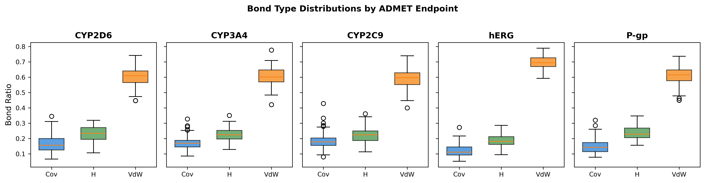
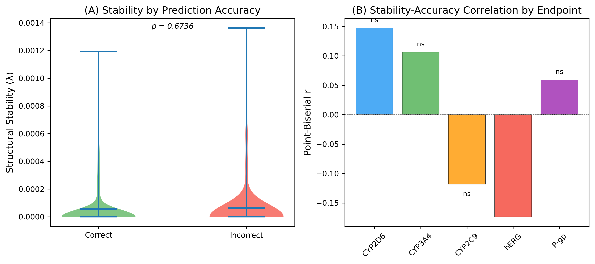
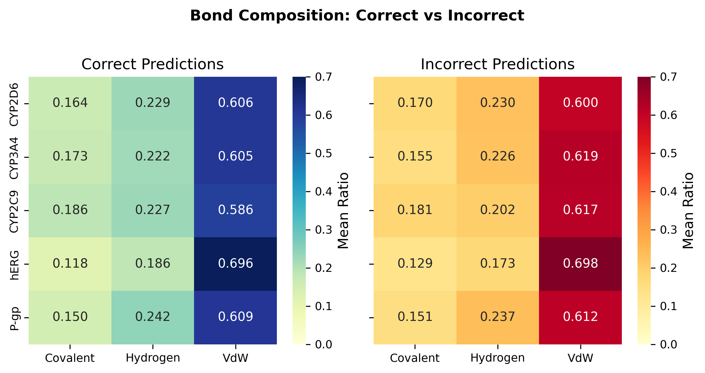
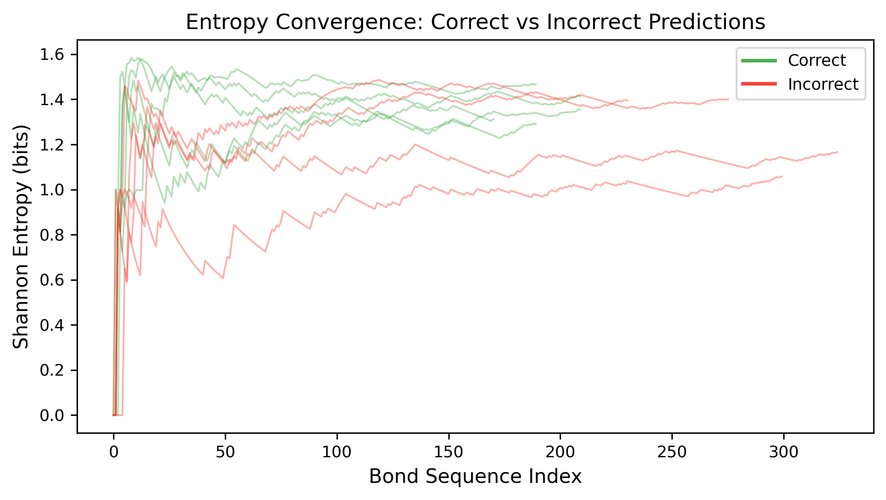
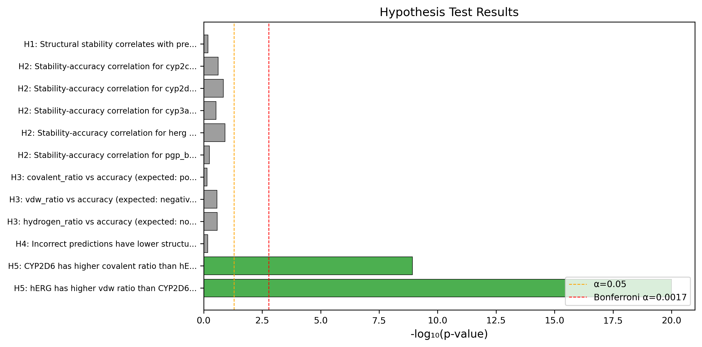
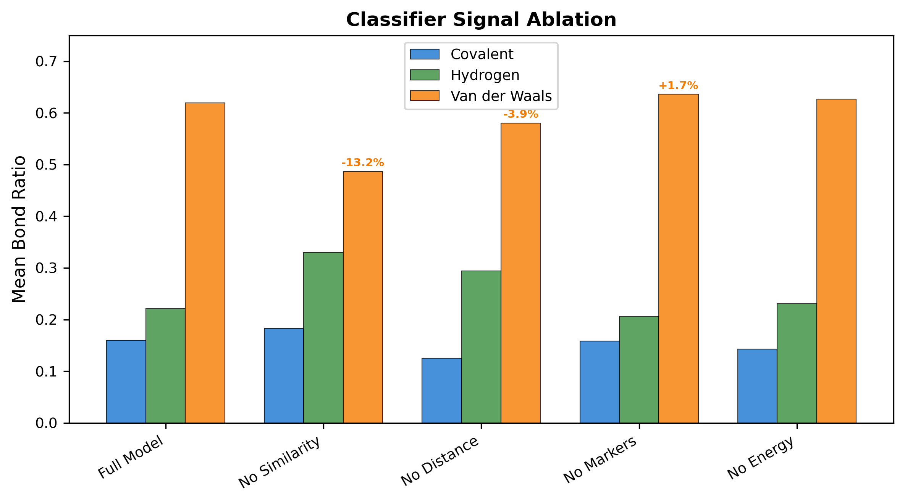
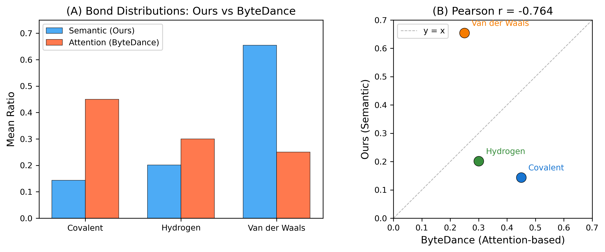

# Technical Summary: Molecular Targets Shape Reasoning Topology

**Ari Harrison, NovoQuant Nexus — February 2026**
**Repo:** https://github.com/realariharrison/molecular-reasoning-structure

---

## Core Claim

Molecular targets determine AI reasoning topology. CYP2D6 reasoning (2D substructure-driven) produces more covalent bonds; hERG reasoning (3D conformation-dependent) produces more van der Waals bonds. Effect sizes are large (Cohen's d = 0.94 and 1.75), surviving Bonferroni correction across 12 tests. This completes a bidirectional loop with Chen, Du, Li et al. (2026): they showed reasoning structure predicts training quality (Direction A); we show the chemistry problem shapes reasoning structure (Direction B).

Four other pre-registered hypotheses (H1–H4) were null: reasoning structure does not predict accuracy in aggregate. The combined result is that structure reflects *what* the model reasons about, not *how well*.

---

## Bond Operationalization

Since Claude is closed-weight (no attention access), we built a **Semantic Bond Classifier** — a four-signal ensemble that classifies bonds between all pairwise reasoning step combinations (i < j):

| Signal | Method | Covalent Vote | Hydrogen Vote | VdW Vote |
|---|---|---|---|---|
| **Semantic similarity** | Cosine sim of sentence-transformer embeddings (all-MiniLM-L6-v2) | sim > 0.6 | 0.4 < sim < 0.6 | sim < 0.4 |
| **Positional distance** | Step index gap \|j − i\| | d ≤ 2 | d ≥ 3 & sim > 0.4 | d ≥ 3 & sim < 0.4 |
| **Discourse markers** | 73 curated keywords matched against step text | "therefore," "because," "this indicates" | "wait," "actually," "let me check" | "alternatively," "what if," "perhaps" |
| **Energy proxy** | E = −log(sim) / distance, mirroring your Gibbs–Boltzmann formulation | E < 0.5 | 0.5 < E < 1.5 | E > 1.5 |

Each signal contributes a weighted vote (similarity: up to 1.0, distance: 0.4, markers: 0.6, energy: 0.3). Winner-take-all classification. Per trace: ~22 reasoning steps → C(22,2) ≈ 231 pairwise bonds classified.

**Ablation result:** Semantic similarity is the dominant signal. Removing it shifts 13.2 percentage points from VdW to hydrogen. Markers and energy contribute < 2 pp each (Figure 6).

---

## Statistical Pipeline

### Unit of analysis
Each of 478 molecules produces one reasoning trace. Per trace, we compute:
- Bond ratios: proportion of covalent, hydrogen, VdW bonds
- Structural stability λ: exponential decay rate of Shannon entropy over the bond sequence

### Pre-registered hypotheses (5 hypotheses, 12 tests)

| Hypothesis | Test | Statistic | p-value | Effect | Sig? |
|---|---|---|---|---|---|
| **H1:** Stability correlates with accuracy | Point-biserial r | r = −0.021 | 0.653 | — | No |
| **H2:** Correlation stronger for hard endpoints | Per-endpoint r | r ∈ [−0.17, 0.15] | all > 0.12 | — | No |
| **H3:** Covalent ↑ → accuracy ↑ | Point-biserial r | r = 0.017 | 0.719 | — | No |
| **H3:** VdW ↑ → accuracy ↓ | Point-biserial r | r = −0.051 | 0.268 | — | No |
| **H3:** Hydrogen (non-monotonic) | Point-biserial r | r = 0.051 | 0.265 | — | No |
| **H4:** Incorrect predictions have lower stability | Independent t-test | t = −0.450 | 0.674 | d = −0.049 | No |
| **H5a:** CYP2D6 covalent > hERG covalent | One-sided t-test | t = 6.29 | 1.2 × 10⁻⁹ | **d = 0.94** | **Yes** |
| **H5b:** hERG VdW > CYP2D6 VdW | One-sided t-test | t = 11.70 | 3.9 × 10⁻²⁴ | **d = 1.75** | **Yes** |

### Multiple comparison correction
- **Bonferroni:** α = 0.05 / 12 = 0.0042. Both H5 tests pass.
- **Benjamini–Hochberg FDR:** Both H5 tests pass.
- All statistics in `data/hypothesis_results.json`.

### Supplementary model
Logistic regression (bond ratios + stability → accuracy): AUROC = 0.531. Bond features do not predict accuracy in aggregate, consistent with H1–H4.

---

## Comparison with Your Method — An Honest Divergence

Your framework defines three interaction types: Deep-Reasoning (covalent-like), Self-Reflection (hydrogen-bond-like), and Self-Exploration (van der Waals-like), classified via attention weight patterns. We map to the same trichotomy but classify from text alone. We ran our Semantic Bond Classifier on 200 OpenThoughts-114k traces to compare directly with your attention-based distributions. **The results diverge and we want to surface this proactively** (paper Section 4.6, Figure 7):

| Bond Type | Ours (Semantic) | Yours (Attention) |
|---|---|---|
| Covalent | 0.144 | 0.450 |
| Hydrogen | 0.202 | 0.300 |
| Van der Waals | 0.655 | 0.250 |

**Pearson r = −0.764** (inverted ranking).

**Why this happens:** OpenThoughts traces average 242 steps. Our pairwise approach produces C(242,2) ≈ 29,000 bonds per trace, and the vast majority of step pairs are positionally distant (d >> 3) and semantically dissimilar — both of which vote VdW. Your attention-based method captures actual semantic relationships via attention weights, not exhaustive pairwise comparison, so it avoids this length-dependent bias.

**Why H5 still holds:** Our primary analysis uses Claude traces (~22 steps, ~231 bonds), where the length bias is much less severe. More importantly, H5 is a *between-endpoint relative difference*, not an absolute proportion claim. Even if our classifier's baseline is VdW-shifted, the fact that CYP2D6 has significantly more covalent and less VdW than hERG — with d = 0.94 and 1.75 — reflects a real structural difference that is robust to the baseline.

**We frame this as a measurement scope limitation**, not a validation failure: the two methods measure complementary aspects of reasoning structure (pairwise semantic similarity vs. attention flow). We'd genuinely welcome your perspective on whether this framing is appropriate, and whether there are ways to bring the methods into closer agreement for moderate-length traces.

---

## Figures

### Figure 1 — Bond Distributions by Endpoint (Primary Result)

CYP2D6 has highest covalent ratio (0.188) and lowest VdW (0.597). hERG has lowest covalent (0.126) and highest VdW (0.648). The 2D→3D gradient across endpoints is visible.

### Figure 2 — Stability vs. Accuracy (Null Result)

(A) Violin plot: correct and incorrect predictions have indistinguishable stability distributions. (B) Per-endpoint correlations are all non-significant.

### Figure 3 — Bond Composition Heatmap

Bond composition is similar between correct and incorrect predictions within each endpoint, consistent with the H3 null.

### Figure 4 — Entropy Convergence

Entropy converges rapidly for both correct (green) and incorrect (red) traces, producing near-zero λ values. The exponential decay model may not be the right fit for moderate-length traces.

### Figure 5 — Hypothesis Test Summary

Only H5 comparisons cross the Bonferroni threshold (red dashed line).

### Figure 6 — Classifier Ablation

Removing semantic similarity causes the largest shift (−13.2 pp VdW). The classifier is primarily driven by learned embeddings, not hand-crafted features.

### Figure 7 — Cross-Method Validation (OpenThoughts)

(A) Our semantic classifier produces VdW-dominant distributions; yours produces covalent-dominant. (B) Inverted ranking (r = −0.76) on the three bond types.

---

## Data Availability

Everything is public at https://github.com/realariharrison/molecular-reasoning-structure:
- `data/traces/` — 478 reasoning trace JSONs (full chain-of-thought)
- `data/bonds/bond_summary.csv` — per-trace bond ratios
- `data/hypothesis_results.json` — all test statistics
- `data/classifier_validation.json` — OpenThoughts comparison
- `data/ablations/classifier_signals.json` — ablation results
- `paper/` — LaTeX manuscript + all figures
